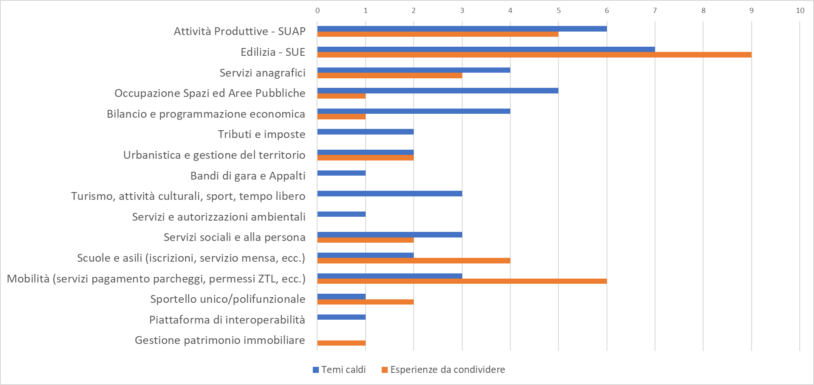

.. _h67473a6627136c42367d3d5f4eb4445:

5. STANDARDIZZAZIONE DELLE SOLUZIONI PER I SERVIZI ONLINE: IL PERCORSO DEL CANTIERE 
####################################################################################

.. _h217b307f733c334e363f516c704c60d:

5.1. L’esigenza di un percorso condiviso
****************************************

Nel corso dell’edizione 2017 del Cantiere dedicato al tema della cittadinanza digitale, è emersa più forte che mai la convinzione che tra gli enti aderenti al tavolo esistano più consonanze che differenze, nonché la convinzione cha sia necessario:

* creare \ |STYLE0|\  sui diversi temi trattati nel corso dell’anno e sintetizzati in questo report;

* non aspettare che la spinta al cambiamento arrivi dall'alto, ma \ |STYLE1|\  con azioni condivise, sviluppate anche in forma collaborativa e informale. 

Esigenze rafforzate da uno scenario in cui molti saranno gli enti chiamati nei prossimi mesi a rinnovare parti importanti del proprio patrimonio applicativo, alla luce sia delle novità introdotte dal Piano triennale, sia dell'obsolescenza di molte soluzioni attualmente utilizzate.

Negli anni passati ha sempre prevalso la logica della contingenza, che ha portato allo sviluppo \ |STYLE2|\  o all'acquisto di prodotti estremamente settoriali, in grado di rispondere all'esigenza del momento e di garantire la disponibilità immediata del servizio, ma limitati ad ambiti circoscritti, impedendo già in partenza l'interoperabilità tra i diversi sistemi. Una situazione difficile da scardinare, causata anche dell'assenza di coordinamento e controllo sulle scelte effettuate dai diversi settori dell’ente.

Una situazione alimentata anche dal mercato italiano delle \ |STYLE3|\ , caratterizzato dall’enorme parcellizzazione e dalla dispersione sul territorio dei diversi fornitori, con la presenza di piccole o micro aziende estremamente specializzate nello sviluppo di sistemi chiamati a gestire processi \ |STYLE4|\  per l'ente locale. 

Il contesto del Cantiere - un ambiente informale ma allo stesso tempo rappresentativo della realtà italiana, alla luce della numerosità e dell'importanza degli enti che vi partecipano - potrebbe rappresentare il palcoscenico ideale per avviare forme di aggregazione nel processo di sviluppo di alcuni dei “pilastri” dei gestionali interni, al fine di riprogettarli in maniera aperta e interoperabile, favorendo lo sviluppo di applicativi più solidi e facendo contestualmente emergere  dei veri e propri “\ |STYLE5|\ ”, non imposti dalle leggi, ma promossi dal basso nell’alveo soluzioni realmente funzionali e ampiamente diffuse.

.. _h5510625a615d114e3d4b43221e2b6f43:

5.2. I principi generali: semplificazione, linguaggio comune, divisione del lavoro
**********************************************************************************

L'idea sviluppata dal Cantiere è quindi quella di avviare un percorso condiviso sul tema dei \ |STYLE6|\  gestionali di \ |STYLE7|\  relativi ai diversi servizi erogati dagli enti locali, e in particolare dai Comuni. Un percorso che presti particolare attenzione al tema dell’interoperabilità e imperniato su tre principi fondamentali: 

* \ |STYLE8|\  delle soluzioni adottate da enti omologhi, anche attraverso la valorizzazione delle iniziative realizzate a livello centrale, come i sopracitati moduli standard sviluppati nell’alveo dell’Agenda per la semplificazione;

* \ |STYLE9|\ , con vocabolari, tassonomie e ontologie di dati condivise e quanto più possibile stabili nel tempo, che facilitino lo scambio di informazioni tra enti e la risoluzione di problemi comuni. Un linguaggio costruito utilizzando i risultati di importanti iniziative nazionali e comunitarie finalizzate alla definizione di ontologie di base, che potrebbero costituire l'elemento minimo di interoperabilità in molti ambiti tematici (attività commerciali, organizzazione delle voci di bilancio, anagrafe dei numeri civici di ISTAT, categorie di dati territoriali individuati dalla direttiva INSPIRE, solo per citarne alcuni);

* \ |STYLE10|\ , mettendo a fattor comune degli elementi già sviluppati da altri enti aderenti al Cantiere, al fine di creare un primo e fondamentale patrimonio informativo comune, riutilizzabile da parte di tutti i membri della community, a patto di accettare livelli di perfezione più bassi rispetto a quelli che si potrebbero raggiungere sviluppando direttamente la soluzione, ma usufruendo in questo modo di soluzioni già pronte all'uso, per poi concentrarsi più avanti sui possibili miglioramenti. 

.. _h4ae24767455c366c3a1e295b3c449:

5.3. Temi di interesse comune e prospettive 2018
************************************************

Punto di partenza di questo percorso è stata l’individuazione degli \ |STYLE11|\  di maggiore interesse per le amministrazioni aderenti al Cantiere, su cui sviluppare nel corso del 2018 un possibile \ |STYLE12|\  sulle relative applicazioni e sulla loro integrazione. 

Nell’ambito dell’edizione 2017, il Cantiere ha quindi effettuato una prima ricognizione su un campione di 15 enti (13 Comuni capoluogo, 1 Regione, 1 Unione dei Comuni) tra quelli aderenti al Cantiere, al fine di individuare:

* i \ |STYLE13|\  su cui l’ente ha deciso o programmato di intervenire nel breve-medio periodo, alla luce di un’esigenza concreta, e su cui potrebbe esistere l’interessa ad avviare un percorso di collaborazione;

* i temi su cui l’ente ritiene di poter portare un’\ |STYLE14|\  con le altre amministrazioni, alla luce di progettualità significative già realizzate che si ritiene di poter mettere a disposizione degli atri

\ |IMG1|\ 

Partendo dall’individuazione dei temi più rilevanti, nel corso del 2018 il Cantiere valuterà la possibilità di:

#. definire \ |STYLE15|\  di elevata qualità per l’architettura IT e le funzioni da realizzare, rinunciando ad alcune possibili customizzazioni a fronte di un guadagno in termini di costi, qualità, scalabilità, funzionalità e riusabilità della soluzione;

#. sviluppare un \ |STYLE16|\ , che potrebbe poi essere riutilizzato da tutte le altre amministrazioni interessate. 

.. bottom of content

.. |STYLE0| replace:: **discontinuità**

.. |STYLE1| replace:: **procedere dal basso**

.. |STYLE2| replace:: *in house*

.. |STYLE3| replace:: *software house*

.. |STYLE4| replace:: *core*

.. |STYLE5| replace:: **standard di fatto**

.. |STYLE6| replace:: *software*

.. |STYLE7| replace:: *back office,*

.. |STYLE8| replace:: **semplificazione e standardizzazione**

.. |STYLE9| replace:: **definizione di un linguaggio comune**

.. |STYLE10| replace:: **divisione del lavoro tra amministrazione**

.. |STYLE11| replace:: **ambiti tematici**

.. |STYLE12| replace:: **percorso di codesign**

.. |STYLE13| replace:: **temi “caldi”**

.. |STYLE14| replace:: **esperienza concreta da condividere**

.. |STYLE15| replace:: **requisiti comuni**

.. |STYLE16| replace:: **capitolato di gara standard**

